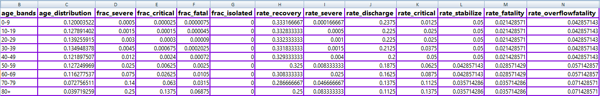

# covid19-simulation-params-json-to-csv

**Agenda**
- Converts a Json exported from https://covid19-scenarios.org/ to csv format
- Here are the falttened csv columns
    

**Usage**
1. Using Web UI
    - [http://sairaghavak.herokuapp.com/covid19params](http://sairaghavak.herokuapp.com/covid19params)
2. Using REST Endpoints as mentioned below
    - Below are the endpoints exposed
       - **/jsontocsv**
          >  POST https://sairaghavak.herokuapp.com/covid19params/api/jsontocsv  
            >  content-type: application/json
            >           
            >  {  
                  1.  Goto https://covid19-scenarios.org/  
                  2. And export/download covid.params.json for specific scenario.  
                  3. Paste the Json content in this body  
              }
            
       - **/uploadjson**
          >  POST https://sairaghavak.herokuapp.com/covid19params/api/uploadjson
            >  content-type: application/json
            >
            >  {  
                  1.  Goto https://covid19-scenarios.org/   
                  2. And export/download covid.params.json for specific scenario.  
                  3. Attach the covid.params.json file here  
              }
           

**Tech Stack**
- [x] Java-8
- [x] Spring boot
- [x] Json-B for Json Deserialization and Serialization
- [x] Project lombok
- [x] Thymeleaf for view
- [x] Twitter bootstrap + JQuery.js + popper.js